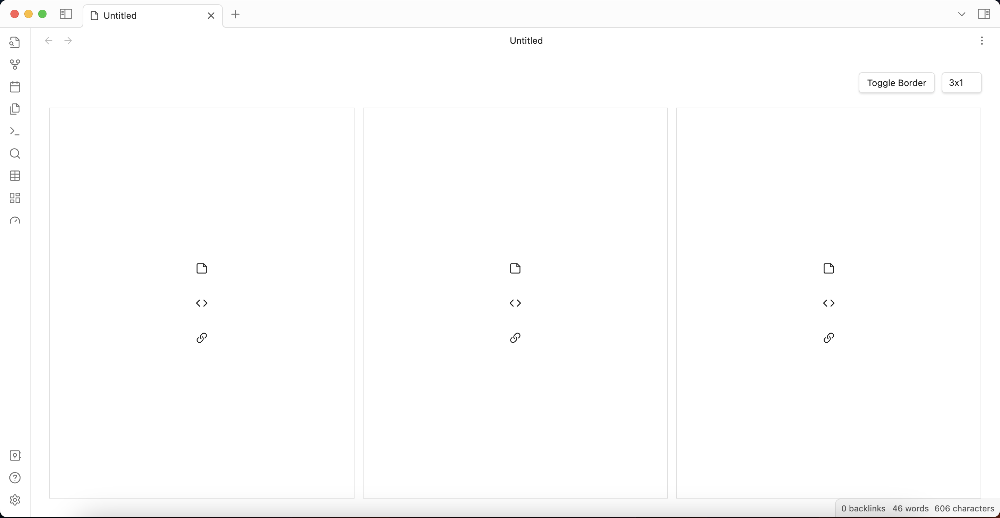
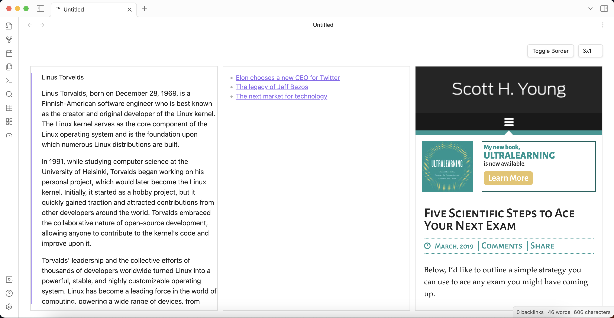
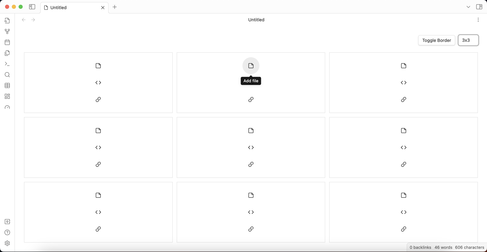

Dashboards is an [Obsidian.md](https://obsidian.md/) plugin. Design your own personalized dashboard or home page. Dashboards offers flexible grid configurations, allowing you to choose from various layouts such as 1x2, 2x2, 3x3, and more. Each grid contains containers where you can embed different elements, including vault files, code blocks, or external urls.

If you are looking for the plugin that was formally called `Dashboards` please see [DataLoom](https://github.com/trey-wallis/obsidian-dataloom)

Support development

## About

-   [Screenshots](#screenshots)
-   [Getting started](#getting-started)
-   [License](#license)

## Screenshots

Create a grid layout

Add embedded content with ease

Use many different layouts

## Getting Started

1. Create a new dashboard file
2. Choose your layout in by using the dropdown in the upper righthand corner
3. In each container, choose a vault file, a code block, or a external link to embed

### Code blocks

Embed any Obsidian code block using the [normal code block syntax](https://help.obsidian.md/Editing+and+formatting/Basic+formatting+syntax#Code+blocks). This may be used to render [Dataview](https://github.com/blacksmithgu/obsidian-dataview), DataviewJS, or [Tasks](https://github.com/obsidian-tasks-group/obsidian-tasks) plugin code blocks.

### Links

Any website will automatically be embedded in an iFrame

## License

Dashboards is distributed under the [MIT License](https://github.com/trey-wallis/obsidian-dashboards/blob/master/LICENSE)
